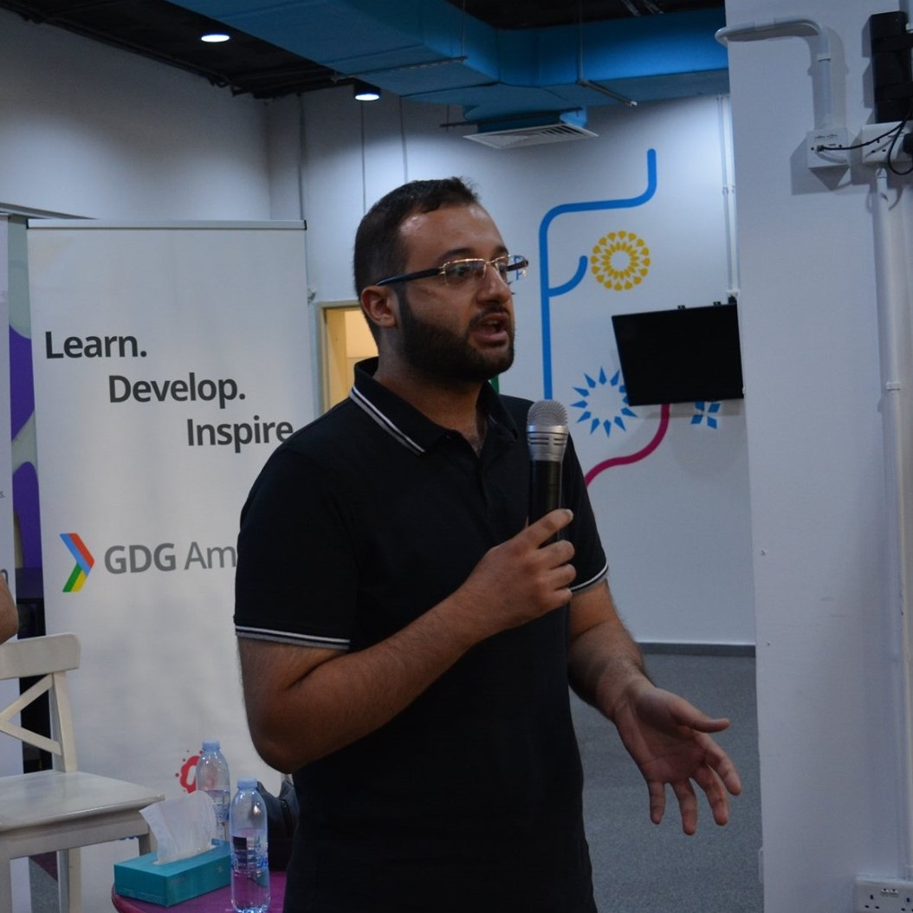

# img2img
This project is a framework to create deep learning models that perform image transformation.

# Back story
It is currently being created as a toy project to enhance my profile picture that was taken in bad light conditions. I once needed a good picture to be used for something related to the company I work for, but the only picture I had is that one. I was/am trying to synthesize dark images and transform them back into the original perfect image. 

My dark stupid image:

# Other motiviations
This repo is meant for educational purposes, for me and for everyone else. Hopefully you will find it fun as I do.
